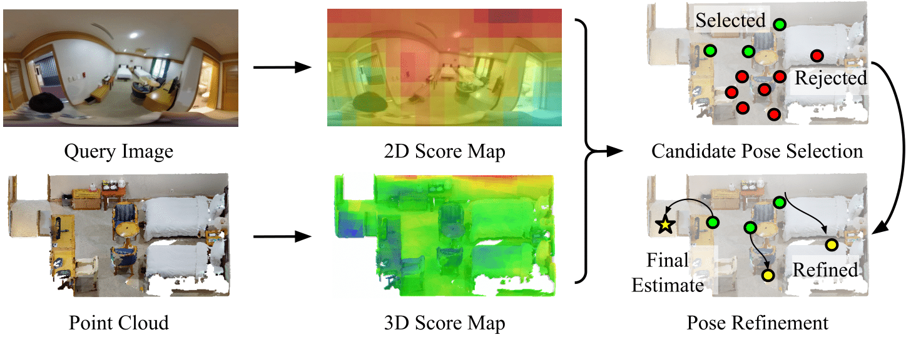

# CPO: Change-Robust Panorama to Point Cloud Localization
:star2: **Update** :star2: Check out the [panoramic localization library](https://github.com/82magnolia/panoramic-localization), which contains implementations of numerous panoramic localization algorithms including CPO. Plus, it is more user-friendly than this repository!

Official PyTorch implementation of **CPO: Change Robust Panorama to Point Cloud Localization (ECCV 2022)** [[Paper]](https://arxiv.org/pdf/2207.05317.pdf)

[](cpo_overview.png)\
CPO is a fast and robust algorithm for localizing a 2D panorama against a 3D point cloud possibly containing changes.
Instead of focusing on sparse feature points, we make use of the dense color measurements provided from the panorama images.
Specifically, we propose efficient color histogram generation and subsequent robust localization using score maps defined over 2D and 3D.

[](cpo_qualitative.jpg)\
In this repository, we provide the implementation of fast histogram generation, which is the key component of CPO that enables candidate pose search and 2D/3D score map generation.
If you have any questions regarding CPO, please leave an issue or contact 82magnolia@snu.ac.kr.

### Installation
To run the codebase, you need [Anaconda](https://www.anaconda.com/). Once you have Anaconda installed, run the following command to create a conda environment.

    conda create --name cpo python=3.7
    conda activate cpo
    pip install -r requirements.txt -f https://download.pytorch.org/whl/torch_stable.html 
    conda install cudatoolkit=10.1

### Running
Please refer to the comments provided in `fast_histogram_generation(...)` from `fast_histogram.py` for using the fast histogram generation code.

## Citation
If you find this repository useful, please cite

```bibtex
@inproceedings{kim2022cpo,
    title={CPO: Change-Robust Panorama to Point Cloud Localization},
    author={Kim, Junho and Jang, Hojun 
            and Choi, Changwoon and Kim, Young Min},
    booktitle={European Conference on Computer Vision},
    year={2022},
    organization={Springer}
}
```
